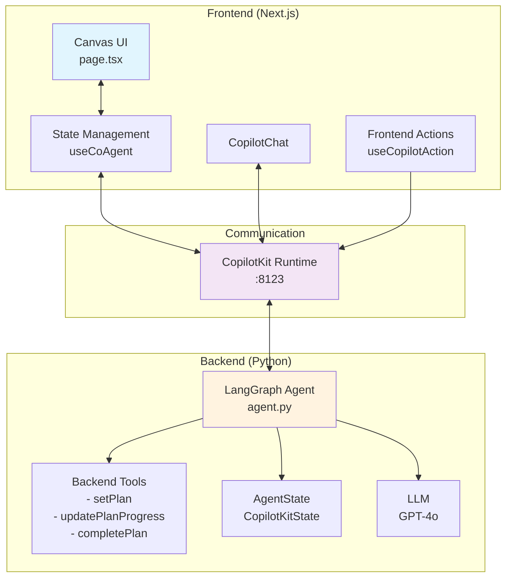
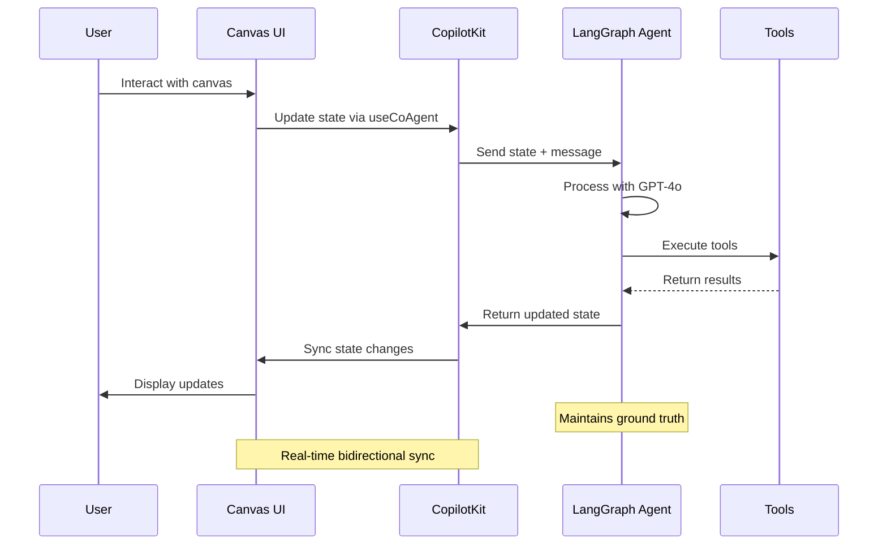

# CopilotKit <> LangGraph AG-UI Canvas Starter

<div align="center">
  
  [](https://www.youtube.com/watch?v=wTZUFelsneg)
  
  Watch the walkthrough video, click the image ⬆️
  
</div>

This is a starter template for building AI-powered canvas applications using [LangGraph](https://www.langchain.com/langgraph) and [CopilotKit](https://copilotkit.ai). It provides a modern Next.js application with an integrated LangGraph agent that manages a visual canvas of interactive cards with real-time AI synchronization.


## 🚀 Key Features

- **Visual Canvas Interface**: Drag-free canvas displaying cards in a responsive grid layout
- **Four Card Types**: 
  - **Project**: Includes text fields, dropdown, date picker, and checklist
  - **Entity**: Features text fields, dropdown, and multi-select tags
  - **Note**: Simple rich text content area
  - **Chart**: Visual metrics with percentage-based bar charts
- **Real-time AI Sync**: Bidirectional synchronization between the AI agent and UI canvas
- **Multi-step Planning**: AI can create and execute plans with visual progress tracking
- **Human-in-the-Loop (HITL)**: Intelligent interrupts for clarification when needed
- **JSON View**: Toggle between visual canvas and raw JSON state
- **Responsive Design**: Optimized for both desktop (sidebar chat) and mobile (popup chat)

## Prerequisites

- Node.js 18+ 
- Python 3.12+
- Any of the following package managers:
  - [pnpm](https://pnpm.io/installation) (recommended)
  - npm
  - [yarn](https://classic.yarnpkg.com/lang/en/docs/install/#mac-stable)
  - [bun](https://bun.sh/)
- OpenAI API Key (for the LangGraph agent)

> **Note:** This repository ignores lock files (package-lock.json, yarn.lock, pnpm-lock.yaml, bun.lock) to avoid conflicts between different package managers. Each developer should generate their own lock file using their preferred package manager. After that, make sure to delete it from the .gitignore.

## Getting Started

1. Install dependencies using your preferred package manager:
```bash
# Using pnpm (recommended)
pnpm install

```

> **Note:** Installing the package dependencies will also install the agent's Python dependencies via the `install:agent` script.


2. Set up your OpenAI API key:
```bash
echo 'OPENAI_API_KEY=your-openai-api-key-here' > agent/.env
```

3. Start the development server:
```bash
# Using pnpm
pnpm dev

```

This will start both the UI and agent servers concurrently.

## Getting Started with the Canvas

Once the application is running, you can:

1. **Create Cards**: Use the "New Item" button or ask the AI to create cards
   - "Create a new project"
   - "Add an entity and a note"
   - "Create a chart with sample metrics"

2. **Edit Cards**: Click on any field to edit directly, or ask the AI
   - "Set the project field1 to 'Q1 Planning'"
   - "Add a checklist item 'Review budget'"
   - "Update the chart metrics"

3. **Execute Plans**: Give the AI multi-step instructions
   - "Create 3 projects with different priorities and add 2 checklist items to each"
   - The AI will create a plan and execute it step by step with visual progress

4. **View JSON**: Toggle between the visual canvas and JSON view using the button at the bottom

## Available Scripts
The following scripts can also be run using your preferred package manager:
- `dev` - Starts both UI and agent servers in development mode
- `dev:debug` - Starts development servers with debug logging enabled
- `dev:ui` - Starts only the Next.js UI server
- `dev:agent` - Starts only the LangGraph agent server
- `build` - Builds the Next.js application for production
- `start` - Starts the production server
- `lint` - Runs ESLint for code linting
- `install:agent` - Installs Python dependencies for the agent

## Architecture Overview



### Frontend (Next.js + CopilotKit)
The main UI component is in [`src/app/page.tsx`](https://github.com/CopilotKit/canvas-with-langgraph-python/blob/main/src/app/page.tsx). It includes:
- **Canvas Management**: Visual grid of cards with create, read, update, and delete operations
- **State Synchronization**: Uses `useCoAgent` hook for real-time state sync with the agent
- **Frontend Actions**: Exposed as tools to the AI agent via `useCopilotAction`
- **Plan Visualization**: Shows multi-step plan execution with progress indicators
- **HITL Interrupts**: Uses `useLangGraphInterrupt` for disambiguation prompts

### Backend (LangGraph Agent)
The agent logic is in [`agent/agent.py`](https://github.com/CopilotKit/canvas-with-langgraph-python/blob/main/agent/agent.py). It features:
- **State Management**: Extends `CopilotKitState` with canvas-specific fields
- **Tool Integration**: Backend tools for planning, and frontend tools for canvas operations
- **Strict Grounding**: Enforces data consistency by always using shared state as truth
- **Loop Control**: Prevents infinite loops and redundant operations
- **Planning System**: Can create and execute multi-step plans with status tracking

### Card Field Schema
Each card type has specific fields defined in the agent:
- **Project**: field1 (text), field2 (select), field3 (date), field4 (checklist)
- **Entity**: field1 (text), field2 (select), field3 (tags), field3_options (available tags)
- **Note**: field1 (textarea content)
- **Chart**: field1 (array of metrics with label and value 0-100)

### Data Flow



## Customization Guide

### Adding New Card Types
1. Define the data schema in [`src/lib/canvas/types.ts`](https://github.com/CopilotKit/canvas-with-langgraph-python/blob/main/src/lib/canvas/types.ts)
2. Add the card type to the `CardType` union
3. Create rendering logic in [`src/components/canvas/CardRenderer.tsx`](https://github.com/CopilotKit/canvas-with-langgraph-python/blob/main/src/components/canvas/CardRenderer.tsx)
4. Update the agent's field schema in [`agent/agent.py`](https://github.com/CopilotKit/canvas-with-langgraph-python/blob/main/agent/agent.py)
5. Add corresponding frontend actions in [`src/app/page.tsx`](https://github.com/CopilotKit/canvas-with-langgraph-python/blob/main/src/app/page.tsx)

### Modifying Existing Cards
- Field definitions are in the agent's system message
- UI components are in [`CardRenderer.tsx`](https://github.com/CopilotKit/canvas-with-langgraph-python/blob/main/src/components/canvas/CardRenderer.tsx)
- Frontend actions follow the pattern: `set[Type]Field[Number]`

### Styling
- Global styles: [`src/app/globals.css`](https://github.com/CopilotKit/canvas-with-langgraph-python/blob/main/src/app/globals.css)
- Component styles use Tailwind CSS with shadcn/ui components
- Theme colors can be modified via CSS custom properties

## 📚 Documentation

- [LangGraph Documentation](https://langchain-ai.github.io/langgraph/) - Learn more about LangGraph and its features
- [CopilotKit Documentation](https://docs.copilotkit.ai) - Explore CopilotKit's capabilities
- [Next.js Documentation](https://nextjs.org/docs) - Learn about Next.js features and API

## Contributing

Feel free to submit issues and enhancement requests! This starter is designed to be easily extensible.

## License

This project is licensed under the MIT License - see the LICENSE file for details.

## Troubleshooting

### Agent Connection Issues
If you see "I'm having trouble connecting to my tools", make sure:
1. The LangGraph agent is running on port 8123 (check terminal output)
2. Your OpenAI API key is set correctly in `agent/.env`
3. Both servers started successfully (UI and agent)

### Port Already in Use
If you see "[Errno 48] Address already in use":
1. The agent might still be running from a previous session
2. Kill the process using the port: `lsof -ti:8123 | xargs kill -9`
3. For the UI port: `lsof -ti:3000 | xargs kill -9`

### State Synchronization Issues
If the canvas and AI seem out of sync:
1. Check the browser console for errors
2. Ensure all frontend actions are properly registered
3. Verify the agent is using the latest shared state (not cached values)

### CopilotKit Import Issue
The agent includes a patch for a known CopilotKit v0.1.63 import issue. If you upgrade CopilotKit and see import errors, you may need to adjust or remove the patch at the top of [`agent/agent.py`](https://github.com/CopilotKit/canvas-with-langgraph-python/blob/main/agent/agent.py).

### Python Dependencies
If you encounter Python import errors:
```bash
npm run install:agent
```

### Dependency Conflicts
If issues persist, recreate the virtual environment:
```bash
cd agent
rm -rf .venv
python -m venv .venv --clear
.venv/bin/pip install --upgrade pip
.venv/bin/pip install -r requirements.txt
```
---

> [!IMPORTANT]
> Some features are still under active development and may not yet work as expected. If you encounter a problem using this template, please [report an issue](https://github.com/CopilotKit/canvas-with-mastra/issues/new/choose) to this repository.
